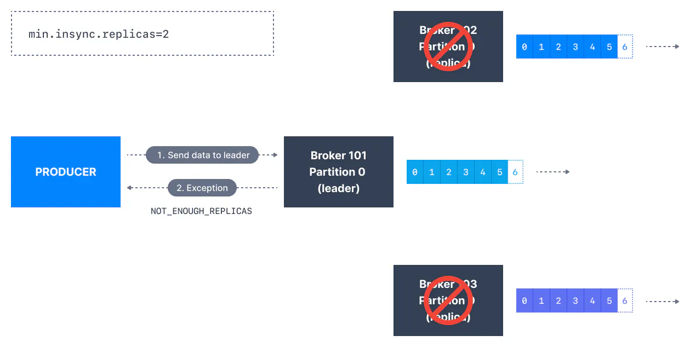

A data stream is typically seen as a sequence of data that could go on indefinitely. 
The name streaming is used because we are interested in the data being accessible as 
soon as it is produced.

Apache Kafka stores data streams for stream processing. Once processed and stored, the data 
can be transferred to other systems, like databases.


### What is Kafka Streams?                                                                    
After we bring data into Kafka from other systems, we can use stream processing applications 
to analyze it in real time.
These applications rely on data stores like Apache Kafka.

To transform topics in Apache Kafka,
we can use streaming libraries instead of writing complex producer and consumer code.

We can use the Kafka Streams library that comes with Apache Kafka for stream processing.
Other options are Apache Spark and Apache Flink.


### What is Kafka Connect?                                                                  
To bring data into Apache Kafka, we use Kafka producers, over the time thinking was 
developed as Creating standardized open-source code for common data sources can be helpful.
Kafka Connect is a tool that connects popular systems with Kafka,
allowing data to be brought into Kafka and moved from Kafka to other data stores using 
existing components.
- **Kafka Connect Source Connectors (producers):** Databases (through the Debezium connector), 
  JDBC, Couchbase, GoldenGate, SAP HANA, Blockchain, Cassandra, DynamoDB,
  FTP, IOT, MongoDB, MQTT, RethinkDB, Salesforce, Solr, SQS, Twitter, etc…
- **Kafka connect Sink Connectors (consumers):** S3, ElasticSearch, HDFS, JDBC, SAP HANA, 
  DocumentDB, Cassandra, DynamoDB, HBase, MongoDB, Redis, Solr, Splunk, Twitter


### What is the Schema Registry?                                                           
The Schema Registry in Apache Kafka manages different types of data formats like 
Apache Avro, Protobuf, and JSON-schema.
It makes sure that the things sending the data and the things receiving it can work 
together.
Without a schema registry, things that send and receive data are at risk of not working 
if the data format changes.

### What is ksqlDB?                                                                       
ksqlDB is a database that processes streams and uses a language like SQL to work with Kafka 
topics.
The ksqlDB webserver turns SQL commands into Kafka Streams applications behind the scenes.


<h2 align="center"> Topic </h2>                                                              
Kafka uses topics to organize messages, similar to how databases use tables.
Each topic is identified by its name, such as logs for log messages and purchases for purchase data.
Kafka topics cannot be queried like database tables.
We use Kafka producers to send data to the topic and Kafka consumers to read the data from the topic in 
order.
Kafka topics can contain messages in any format.
The sequence of these messages is called a data stream.


By default, data in Kafka topics is deleted after one week, and this timeframe is adjustable to 
prevent disk space shortage.

### What are Kafka Partitions?                                                                          
Topics are divided into partitions, with a single topic potentially having more than one hundred partition.
The number of partitions for a topic is set when the topic is created and they are numbered from 0 to N-1,
where N represents the total number of partitions.
The diagram below illustrates a topic with three partitions, each receiving appended messages.
The offset is a unique integer value assigned to each message as it is written into a partition.
This offset serves as an identifier for every message within a particular partition.


> Kafka topics are immutable: once data is written to a partition, it cannot be changed.

### What are Kafka Offsets?                                                                              
- The Apache Kafka offsets indicate the message position within a Kafka Partition.
- Each partition starts counting offsets from 0 and increases with every message.
- This means that each Kafka offset is only meaningful within a specific partition.

> #### If a topic has multiple partitions, Kafka guarantees message order within a partition, but not across partitions.

- Once messages are deleted in Kafka topics, the offsets continue to increment endlessly, ensuring unique identification
for each message within its partition.

<h2 align="center"> Producers </h2>
When working with Kafka, after creating a topic, the next step involves sending data to the topic,
and this is where Kafka Producers come into play.
A Kafka producer sends messages to a topic, and messages are distributed to partitions according to some
rules.


### Message Keys                                                                                          
Each message can have an optional key and a value. The key determines the partition for the message.
- **key = null:** Messages are distributed evenly across partitions in a topic.
This means messages are sent in a round-robin fashion
(partition p0 then p1 then p2, etc... then back to p0 and so on...).
-  **key != null:** All messages that share the same key will always be sent and stored in the same Kafka 
partition.

Kafka message keys are frequently used to ensure message ordering for all messages that share a 
common field.


### Kafka Message Structure
#### Each Kafka message is composed of the following elements:
- **Key:** Key is optional in the Kafka message and it can be null.
A key may be a string, number, or any object, and then the key is serialized into binary format.
- **Value:** The value represents the content of the message and can also be null.
The value format is random and is then also serialized into binary format.
- **Compression Type:** Kafka messages may be compressed. 
The compression type (none, gzip, lz4, snappy, and zstd) can be specified as part of the message.
- **Headers:** There can be a list of optional Kafka message headers in the form of key-value pairs. 
It is common to add headers to specify metadata about the message, especially for tracing.
- **Partition + Offset:** Once a message is sent into a Kafka topic, 
it receives a partition number and an offset id. 
The combination of topic+ partition + offset uniquely identifies the message.
- **Timestamp:** A timestamp is added either by the user or the system in the message.


### Kafka Message Serializers
The process of converting the producer's programming object into binary is called message serialization.
Because Kafka brokers require byte arrays as keys and values for messages.


<h2 align="center"> Consumers </h2>
Applications that read data from Kafka topics are known as consumers.
Applications integrate a Kafka client library to read from Apache Kafka.
Excellent client libraries exist for almost all programming languages that are popular today including 
Python, Java, Go, and others.
consumers can read from one or more partitions at a time, and data is read in order within each partition.


Consumer always reads data from a lower offset to a higher offset and cannot read data backwards.
When a consumer reads data from multiple partitions in Apache Kafka,
the message order across partitions is not guaranteed because they are consumed simultaneously.
However, the message read order is still guaranteed within each partition.</br>
Consumers will only read data generated after they initially connected to Kafka by default. 
It indicates that to read past data consumer must be configured explicitly.</br>
Kafka consumers are also known to implement a "pull model".
This means that Kafka consumers must request data from Kafka brokers to get it
(instead of having Kafka brokers continuously push data to consumers).
This implementation was made so that consumers can control the speed at which the topics 
are being consumed.</br>

### Message Deserializers 
The data sent by the Kafka producers is serialized,
so it must be correctly deserialized after it is received by the Kafka consumers.
The format that the data was serialized in must be used to deserialize it before consumption.</br>
- If the producer serialized a String using StringSerializer, the consumer must deserialize it 
using StringDeserializer

- If the producer serialized an Integer using IntegerSerializer, the consumer must deserialize it 
using IntegerDeserializer


<h2 align="center"> Consumer Groups & Offsets </h2>
Consumers that are part of the same application and therefore performing the same "logical job"
can be grouped together as a Kafka consumer group.
A topic usually consists of many partitions. These partitions are a unit of parallelism for 
Kafka consumers and consumers within the group will coordinate to split the work of reading from 
different partitions.


We must specify the consumer-side setting ```group.id``` to add consumer in a group.
Kafka Consumers automatically use a ```GroupCoordinator``` and a ```ConsumerCoordinator``` to assign 
consumers to a partition and ensure the load balancing is achieved across all consumers in the same group.
> It is important to note that each topic partition is only assigned to one consumer within a consumer 
group, but a consumer from a consumer group can be assigned multiple partitions.


Usually, we have as many consumers in a consumer group as the number of partitions.

### Consumer Offsets
Kafka brokers use an internal topic named ```__consumer_offsets``` that keeps track of what messages 
a given consumer group last successfully processed, for that consumer will regularly commit the latest 
processed message, also known as consumer offset.


Most client libraries automatically commit offsets to Kafka for you periodically,
and the responsible Kafka broker will ensure writing to the ```__consumer_offsets``` topic therefore, 
consumers do not write to that topic directly.</br>

The process of committing offsets is not done for every message consumed (because this would be inefficient),
and instead is a periodic process.</br>

This also means that when a specific offset is committed,
all previous messages that have a lower offset are also considered to be committed.

<h2 align="center"> Brokers </h2>
A single Kafka server is called a Kafka Broker.
we learned that a topic may have more than one partition.
Each partition may live on different servers, also known as Kafka brokers.

### Cluster
An ensemble of Kafka brokers working together is called a Kafka cluster.
Some clusters may contain just one broker or others may contain three or potentially 100 brokers. 
Companies like Netflix and Uber run hundreds or thousands of Kafka brokers to handle their data.</br>
A broker in a cluster is identified by a unique numeric ID.


### Bootstrap Server

A client that wants to send or receive messages from the Kafka cluster may connect to any broker in the 
cluster. Every broker in the cluster has metadata about all the other brokers and will help the client 
connect to them as well, and therefore ***any broker in the cluster is also called a bootstrap server.***


<h2 align="center"> Topic Replication </h2>
Replication means that data is written down not just to one broker, but many.

> Data Replication helps prevent data loss by writing the same data to more than one broker.


if a topic is stored on two brokers, that means we have given a replication factor of 2.

> ***The replication factor is a topic setting and is specified at topic creation time.***


### ***What are Partition Leaders and Replicas?***
For a given topic-partition, the cluster designates one Kafka broker to be responsible for sending and 
receiving data to clients. That broker is known as the ***leader broker*** of that topic partition. 
Any other broker storing replicated data for that partition is referred to as a replica.</br>
If the leader broker were to fail, one of the replicas will be elected as the new partition leader by an election.

> ***Therefore, each partition has one leader and multiple replicas.***


### ***What are In-Sync Replicas (ISR)?***
An ISR is a replica that is up to date with the leader broker for a partition.
Any replica not up to date with the leader is **out of sync**.

### ***producers acks setting***
Kafka producers only write data to the current leader broker for a partition.
```acks``` used to specify the message must be written to a minimum number of replicas before being 
considered a successful write of message. 
> if using Kafka < v3.0, ```acks=1```
> if using Kafka >= v3.0, ```acks=all```

```acks = 0``` : does not acknowledge for any successful writing of a message.


```acks = 1``` : acknowledge required from leader partition for successful writing of a message.


```acks = all``` : acknowledge required from leader partition and all ISR partition for successful 
writing of a message.


We can control the value of ```all``` by using another property of broker ```min.insync.replicas``` 
(this can also be applied at topic level).
The value of this property ensures that minimum partition must be written to the amount of value in sync,
others can be out of sync.
somehow message is not written to the ```min.insync.replicas``` int that case producer will get 
```NotEnoughReplicasException```



### Consumers Replicas Fetching
Kafka consumers read by default from the partition leader.


But since Apache Kafka 2.4, it's been possible to configure consumers to read 
from in-sync replicas instead (usually the closest).</br>


<h2 align="center"> Zookeeper </h2>

Zookeeper is used to track cluster state, broker membership and leadership.

> - Kafka 0.x, 1.x & 2.x must use Zookeeper
> - Kafka 3.x can work without Zookeeper (KIP-500) but is not production ready yet 
> - Kafka 4.x will not have Zookeeper

- Zookeeper keeps track of which brokers are part of the Kafka cluster
- Zookeeper is used by Kafka brokers to determine which broker is the leader of a given partition and 
topic and perform leader elections
- Zookeeper stores configurations for topics and permissions
- Zookeeper sends notifications to Kafka in case of changes 
(e.g., new topic, broker dies, broker comes up, delete topics, etc.…)
- Zookeeper has a leader to handle writes, the rest of the servers are followers to handle reads.
- Servers inside zookeeper cluster are called ***quorum***


<h2 align="center"> KRaft Mode </h2>
The Kafka project undertook one of its greatest changes with the introduction of KIP-500 on August 
1st 2019: the desire to ***remove Zookeeper*** as a dependency to running Apache Kafka.


<h2 align="center"> Log Compaction </h2>

```log.cleanup.policy``` will decide for how much amount of time kafka will clean up the message. 
There are two cleanup policies: </br>
- ```log.cleanup.policy=delete``` : This is ***default*** for all user topics. With this policy configured for a topic, Kafka deletes events older than the configured retention time. 
The default retention period is a week.
- ```log.cleanup.policy=compact``` : This is default for Kafka's ```__consumer_offsets``` topic. With this
policy on a topic, Kafka only stores the **most recent** value for each key in the topic. Setting the 
policy to compact only makes sense on topics for which applications produce events that contain 
both a key and a value.
> Error you can get:- Cannot produce with an empty key in a compacted topic. Provide a non-empty key.


